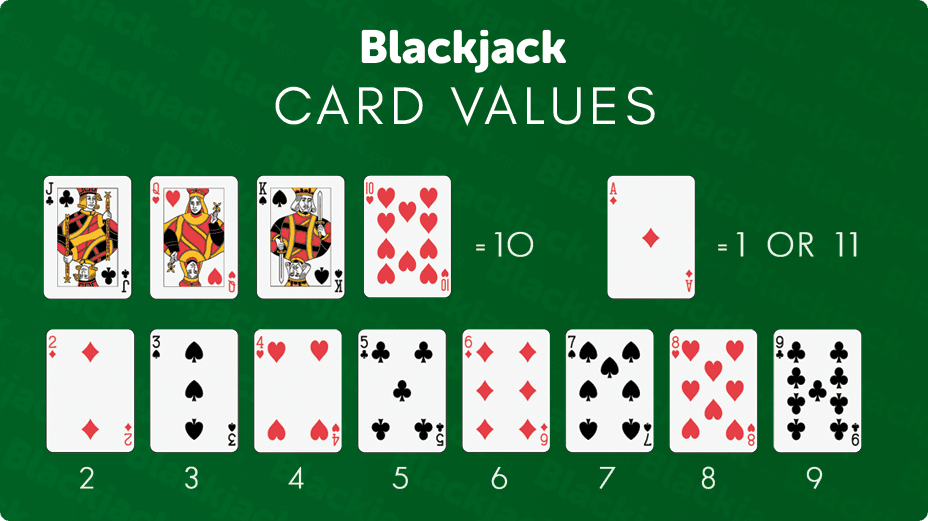

# BlackJack

 

### BLACKJACK RULES
The objective of blackjack is: to beat the dealer’s hand by either:
* 1) having a total that exceeds the dealer’s total
* 2) by not going over 21 when the dealer does.

### CARD VALUES
As mentioned at the top, all cards count their face value in blackjack. Picture cards count as 10 and the ace can count as either 1 or 11. Card suits have no meaning in blackjack. The total of any hand is the sum of the card values in the hand. A hand containing a 4-5-8 totals 17. Another containing a queen-5 totals 15. It is always assumed that the ace counts as 11 unless so doing would make your hand total exceed 21, in which case the ace reverts to a value of 1.

### BUSTING
When a player or dealer’s hand exceeds a total of 21, this is known as busting. (Sometimes the term “break” is used when the dealer’s hand exceeds 21.) So if a player was dealt a 10-6, drew one more card which was a 9, the player busted (i.e., because his hand totaled 25).

### HITTING RULES
This means you want the dealer to give another card to your hand. 

### STANDING RULES
This means you are satisfied with the total of the hand and want to stand with the cards you have.

### DEALER’S PLAYING RULES
Unlike players, the dealer in blackjack has no playing options. Casino rules specify that a dealer must draw if her hand totals less than 17 and stand when the total is 17 to 21. In some casinos, dealers must stand on soft 17 and in others they must hit. It’s better for the player if the rules specify the dealer must stand on soft 17.

### WINNING AND LOSING A HAND
If the player’s hand exceeds a total of 21, the player automatically loses. If the player’s unbusted hand exceeds the total of the dealer’s hand, the player wins. If the player and dealer have the same total, the hand is a tie, or push. If a player scores exactly 21 on the first hand, it is a 'Blackjack' win. 
